# MediCheck — Requirements & Design Document

**Project:** MediCheck — AI-Powered Healthcare Bill Accuracy & Dispute Assistant  
**Version:** 1.0  
**Sprint:** 1  
**Team:** Shifali Srivastava & Nadia van der Merwe  
**Programme:** Quantic MSSE Capstone  
**Last Updated:** March 2026

---

## Table of Contents

1. [Personas](#personas)
2. [User Stories](#user-stories)
   - [Persona 1 — First-Time Patient (Sarah)](#persona-1--sarah-first-time-patient)
   - [Persona 2 — Disputing Patient (Marcus)](#persona-2--marcus-repeat-patient--disputer)
   - [Persona 3 — Developer (Jordan)](#persona-3--jordan-clinic-integration-developer)
3. [User Journey](#user-journey)
4. [System Requirements](#system-requirements)
   - [Functional Requirements](#functional-requirements)
   - [Non-Functional Requirements](#non-functional-requirements)
5. [Requirements Traceability Matrix](#requirements-traceability-matrix)

---

## 1. Personas

## Persona 1: Sarah — First-Time Patient User

**Demographics**

| Field | Detail |
|---|---|
| Age | 34 |
| Occupation | Office Manager |
| Income | $65,000/year |
| Location | Charleston, South Carolina |
| Medical Billing Knowledge | None (never disputed a bill before) |
| Technology Comfort | High — uses smartphone apps daily, comfortable uploading documents |

**Pain Points**

- Received a $2,400 bill from MUSC Health after routine knee arthroscopy
- Suspects errors but doesn't understand CPT codes or medical terminology
- Spent 2 hours Googling medical billing, still confused
- Doesn't know if $2,400 is reasonable or excessive
- Afraid to call hospital billing (intimidating, long hold times)

**Goals**

- Find errors quickly without learning medical billing
- Understand which charges are questionable in plain English
- Get evidence to dispute errors (letter template, regulatory citations)
- Avoid overpaying for medical care

**Quote**

> "I know something's wrong with this bill, but I have no idea where to start. I just want someone to tell me if I'm being ripped off."

**Why Sarah matters to MediCheck**

Sarah represents the majority of MediCheck's target users — patients with no billing expertise who receive a bill that feels wrong but have no tools or knowledge to act on that instinct. Her scenario maps directly to Demo Scenario B: an Ambetter HMO marketplace patient treated at MUSC Health, with a facility fee at 340% of Medicare rate and a potential EOB mismatch on a radiology code. She is the primary persona for the user journey map and the key driver of the plain-English explanation and dispute letter features.

---

## Persona 2: Marcus — Repeat Patient User

**Demographics**

| Field | Detail |
|---|---|
| Age | 52 |
| Occupation | Small Business Owner (HVAC company) |
| Income | $95,000/year |
| Location | Greenville, South Carolina |
| Medical Billing Knowledge | Moderate — fought errors on previous bills, won $600 dispute |
| Technology Comfort | Medium-High — uses QuickBooks, comfortable with spreadsheets and reports |

**Pain Points**

- Spent 8 hours manually checking his last Prisma Health Medical Group bill line-by-line against Medicare rates
- Found $600 in errors (duplicate CT scan, upcoded office visit) through manual work alone
- Knows billing errors are common but manual verification is exhausting and unsustainable
- Wants to check bills proactively before paying, not after the fact
- Needs legal citations and regulatory references to give his disputes credibility

**Goals**

- Automate error detection to save time on every new bill
- Compare charges to Medicare rates instantly without spreadsheet work
- Get regulatory citations (No Surprises Act, CMS guidelines) for legal leverage
- Download a ready-to-send dispute letter with specific errors and dollar amounts cited

**Quote**

> "I know how to fight these errors, but I don't have 8 hours to spend on every bill. I need a tool that does the heavy lifting for me."

**Why Marcus matters to MediCheck**

Marcus represents power users who already know the system can be wrong and have the motivation to dispute — they just need automation to make it practical. His scenario maps to Demo Scenario C: a Molina Healthcare patient at Prisma Health Medical Group, where a diabetes follow-up visit was upcoded from an established patient routine visit (CPT 99213, $87 Medicare rate) to a new patient high-complexity visit (CPT 99205, $280), triggering Module 2 (Medicare rate outlier). Marcus is the primary driver of the regulatory citation feature, the Medicare rate comparison, and the structured dispute letter with line-item specificity.

---

## Persona 3: Jordan — Clinic Integration Developer

**Demographics**

| Field | Detail |
|---|---|
| Role | Full-Stack Developer |
| Employer | Atrium Health patient portal team, Charlotte, NC |
| Team Size | 4 developers |
| Technical Knowledge | High — REST APIs, JSON, React, Node.js, PostgreSQL |
| Technology Stack | Node.js backend, React frontend, PostgreSQL database |

**Pain Points**

- Patients call the Atrium Health billing team to dispute charges — staff are overwhelmed and the volume is growing
- No existing tool provides structured, machine-readable billing error output that can be embedded directly in a patient portal
- Building error detection in-house would require medical billing domain expertise the team doesn't have and can't hire quickly
- Needs clean REST endpoints, consistent JSON response schemas, and predictable error codes to integrate without lengthy back-and-forth
- Must handle edge cases gracefully — timeouts from the RAG service and malformed input cannot crash the portal

**Goals**

- Call POST /upload, POST /confirm, and POST /analyse from the clinic's existing React portal with minimal integration work
- Receive structured JSON responses with error type, severity, affected line items, and estimated dollar impact for each detected error
- Display RAG-grounded plain-English explanations and a dispute letter download button in the patient-facing portal UI
- Handle Service 2 and Service 3 timeouts gracefully — show a meaningful user message, never expose a raw 500 error
- Use clear API documentation and example request/response payloads to complete integration within a single sprint

**Quote**

> "If the endpoints are consistent and the JSON is predictable, I can wire this into our portal in a sprint. I just need docs and example responses — I'll handle the rest."

**Why Jordan matters to MediCheck**

Jordan represents the developer perspective on MediCheck's internal API design. While Sarah and Marcus care about the end-user experience, Jordan cares about reliability, schema consistency, timeout handling, and documentation quality. Jordan's scenario maps to Demo Scenario A: the Atrium Health Carolinas Medical Center crossborder surgery case, where a BCBS SC PPO patient treated at an NC facility encounters an out-of-network anaesthesiologist (No Surprises Act violation), a duplicate surgical tray charge, and an upcoded anaesthesia time — all four modules firing. Jordan's goals directly drive the structured JSON response format, the graceful degradation behaviour when Service 3 times out, and the /health endpoint requirements.

---

## Persona Summary

| | Sarah | Marcus | Jordan |
|---|---|---|---|
| Type | First-time patient | Repeat patient / disputer | Clinic integration developer |
| Location | Charleston, SC | Greenville, SC | Charlotte, NC |
| Drives | Plain-English output, upload UX, OCR confirmation | Medicare rate comparison, regulatory citations, dispute letter | JSON schema, timeout handling, /health endpoint, docs |
| Demo scenario | Scenario B (MUSC Health, Ambetter) | Scenario C (Prisma Health, Molina) | Scenario A (Atrium Health, BCBS SC) |
| Primary modules | 1 (duplicate), 2 (rate outlier) | 2 (rate outlier / upcoding) | All four modules |
| MoSCoW priority | Must Have | Must Have | Should Have |

---

## 2. User Stories

## Persona 1 — Sarah (First-Time Patient)

Sarah is a 34-year-old office manager in Charleston, SC with no medical billing knowledge. She received a $2,400 bill from MUSC Health and suspects errors but doesn't know where to start.

---

### US-001 — Upload a medical bill for analysis

**As a** first-time patient user,  
**I want to** upload my medical bill as a PDF or photo,  
**so that** the system can extract its charges and analyse them for errors without me needing to type anything manually.

**Priority:** Must Have  
**Story Points:** 5  
**Sprint:** 2  
**Epic:** OCR & Field Confirmation  
**Requirements:** REQ-F001, REQ-F002  

**Acceptance Criteria**

- [ ] Drag-and-drop upload zone accepts PDF, JPG, and PNG files
- [ ] File size validation rejects files over 10 MB with a clear error message
- [ ] Upload progress bar is visible during file transfer
- [ ] On successful upload, user sees a confirmation message and transitions to field confirmation screen
- [ ] On failure (network timeout, corrupt file), user sees an actionable error message with a retry option

---

### US-002 — Review and correct extracted bill fields

**As a** first-time patient user,  
**I want to** see the data extracted from my bill in an editable table with confidence scores,  
**so that** I can fix any OCR errors before analysis runs and trust that the findings are based on accurate input.

**Priority:** Must Have  
**Story Points:** 5  
**Sprint:** 2  
**Epic:** OCR & Field Confirmation  
**Requirements:** REQ-F003, REQ-F004, REQ-NF004  

**Acceptance Criteria**

- [ ] Extracted fields are displayed in a table with columns: Field Name, Extracted Value, Confidence Score, Corrected Value
- [ ] Fields with confidence below 80% are highlighted in yellow
- [ ] Every field is editable inline — clicking a value opens an edit input
- [ ] Date fields validate to MM/DD/YYYY format; amount fields validate to $XX.XX format
- [ ] "Confirm & Analyse" button is disabled until the user has reviewed all highlighted fields
- [ ] Confirmed data is stored in PostgreSQL before analysis begins

---

### US-003 — Receive analysis results within 30 seconds

**As a** first-time patient user,  
**I want to** see my bill analysis results within 30 seconds of clicking "Analyse",  
**so that** I don't abandon the tool while waiting and lose confidence in the process.

**Priority:** Must Have  
**Story Points:** 3  
**Sprint:** 3  
**Epic:** Knowledge Base & Error Detection  
**Requirements:** REQ-NF001, REQ-P001  

**Acceptance Criteria**

- [ ] Analysis results are returned to the UI within 30 seconds for bills up to 20 pages
- [ ] A progress indicator shows which detection module is currently running (duplicate check, rate comparison, etc.)
- [ ] If Service 3 (RAG) times out, the error report still loads with core error data and a "Retry explanations" option
- [ ] If no errors are detected, a positive confirmation message is shown with a summary of what was checked

---

### US-004 — Understand billing errors in plain English

**As a** first-time patient user,  
**I want to** see each detected error explained in plain English with the specific line items affected,  
**so that** I can understand what went wrong without needing to know medical billing terminology.

**Priority:** Must Have  
**Story Points:** 5  
**Sprint:** 4  
**Epic:** RAG Integration & Dispute Letters  
**Requirements:** REQ-F005, REQ-F006  

**Acceptance Criteria**

- [ ] Each error card displays: error type, affected line item numbers, estimated dollar impact, and a plain-English explanation
- [ ] Explanations contain no unexplained medical jargon — CPT codes are accompanied by plain descriptions
- [ ] Each explanation includes at least one regulatory or source citation (CMS, Congress.gov)
- [ ] Error cards are colour-coded: red for high severity (>$100 impact), amber for medium ($50–$100), green for informational (<$50)
- [ ] A savings summary card at the top shows total errors found and total potential savings

---

### US-005 — Download a dispute letter with regulatory citations

**As a** first-time patient user,  
**I want to** download a professionally formatted dispute letter that cites the specific errors found and references relevant regulations,  
**so that** I can submit it to the hospital or insurance company without needing to write it myself or hire a lawyer.

**Priority:** Must Have  
**Story Points:** 5  
**Sprint:** 4  
**Epic:** RAG Integration & Dispute Letters  
**Requirements:** REQ-F007, REQ-F008  

**Acceptance Criteria**

- [ ] "Generate Dispute Letter" button appears on the error report page when at least one error is detected
- [ ] Letter includes: patient name, provider name, bill reference number, date of service, each error with specific line items and dollar amounts, and regulatory citations
- [ ] Letter is available for download in both Word (.docx) and PDF formats
- [ ] Word version is fully editable so the user can add personal details before sending
- [ ] Letter generation completes within 10 seconds of clicking the button

---

### US-006 — Trust that my data is private

**As a** first-time patient user,  
**I want to** be clearly informed that my medical bill is not stored permanently,  
**so that** I feel safe uploading sensitive personal health information without creating an account.

**Priority:** Must Have  
**Story Points:** 2  
**Sprint:** 2  
**Epic:** Three-Service Infrastructure  
**Requirements:** REQ-S001, REQ-S002  

**Acceptance Criteria**

- [ ] Homepage and upload page display a clear privacy statement: "Your bill is processed securely and deleted after 24 hours"
- [ ] No account or email address is required to use the tool
- [ ] All communication between client and server uses HTTPS
- [ ] No PHI is retained in PostgreSQL after the session expires (24-hour auto-delete)

---

## Persona 2 — Marcus (Repeat Patient / Disputer)

Marcus is a 52-year-old small business owner in Greenville, SC. He knows billing errors are common, has won disputes before, and needs automation to make checking every bill practical.

---

### US-007 — Compare billed charges to Medicare rates instantly

**As a** repeat patient user who disputes billing errors,  
**I want to** see each charge compared to the Medicare rate for the same procedure,  
**so that** I can immediately identify which items are outliers without spending hours on a Medicare fee schedule spreadsheet.

**Priority:** Must Have  
**Story Points:** 5  
**Sprint:** 3  
**Epic:** Knowledge Base & Error Detection  
**Requirements:** REQ-F009, REQ-F010  

**Acceptance Criteria**

- [ ] Error report shows the Medicare rate alongside the billed amount for every line item where a rate comparison is possible
- [ ] Items exceeding 300% of the Medicare rate are automatically flagged as outliers
- [ ] The ratio is displayed as a percentage (e.g., "327% of Medicare rate")
- [ ] The Medicare locality used for comparison is identified (e.g., "CMS Locality 07 — Rest of South Carolina")
- [ ] Source citation links to the current CMS Physician Fee Schedule

---

### US-008 — Detect duplicate charges automatically

**As a** repeat patient user who disputes billing errors,  
**I want to** have the system automatically detect when the same CPT code is billed twice on the same date,  
**so that** I don't have to manually scan line items to catch a duplication that the hospital may claim was accidental.

**Priority:** Must Have  
**Story Points:** 3  
**Sprint:** 3  
**Epic:** Knowledge Base & Error Detection  
**Requirements:** REQ-F011  

**Acceptance Criteria**

- [ ] System flags any CPT code that appears more than once with the same date of service
- [ ] Both affected line items are identified by line number in the error card
- [ ] Estimated savings equals the cost of the duplicate line item
- [ ] Module correctly ignores the same CPT code billed on different dates (not a duplicate)
- [ ] Unit tests pass for: exact duplicate (flag), same code different date (no flag), same code different procedure room (flag with note)

---

### US-009 — Get regulatory citations I can use in a formal dispute

**As a** repeat patient user who disputes billing errors,  
**I want to** receive specific regulatory references (No Surprises Act, CMS guidelines, MPFS) in the error report and dispute letter,  
**so that** my dispute carries legal weight and the hospital billing department takes it seriously.

**Priority:** Must Have  
**Story Points:** 3  
**Sprint:** 4  
**Epic:** RAG Integration & Dispute Letters  
**Requirements:** REQ-F006, REQ-F008  

**Acceptance Criteria**

- [ ] Every error explanation includes at least one citation with: source name, document title, section or chapter reference
- [ ] Citations link to the publicly accessible source document (CMS.gov, Congress.gov)
- [ ] Dispute letter includes regulatory citations in the body text, not just as footnotes
- [ ] RAG explanations are grounded — every factual claim in the explanation is supported by a retrieved knowledge base passage
- [ ] Citation accuracy is measurable and documented in the evaluation report (target >85%)

---

### US-010 — Reconcile my bill against my insurance EOB

**As a** repeat patient user who disputes billing errors,  
**I want to** upload both my provider bill and my insurance Explanation of Benefits,  
**so that** the system can cross-reference them and flag any discrepancies between what the provider billed and what the insurer processed.

**Priority:** Should Have  
**Story Points:** 8  
**Sprint:** 3  
**Epic:** Knowledge Base & Error Detection  
**Requirements:** REQ-F012  

**Acceptance Criteria**

- [ ] Upload page offers an optional second upload zone labelled "EOB (optional — for enhanced analysis)"
- [ ] When EOB is uploaded, Module 3 (EOB Reconciliation) runs and cross-references line items by date, CPT code, and amount
- [ ] Mismatches are flagged with both the bill value and the EOB value shown side by side
- [ ] If no EOB is uploaded, Module 3 is skipped gracefully — no error shown to user
- [ ] Fuzzy matching handles minor formatting differences between bill and EOB (e.g., date format variations)

---

### US-011 — Detect potential No Surprises Act violations

**As a** repeat patient user who disputes billing errors,  
**I want to** be alerted when my bill may contain a balance billing charge that is prohibited under the No Surprises Act,  
**so that** I can dispute charges from out-of-network providers in contexts where federal law protects me.

**Priority:** Should Have  
**Story Points:** 5  
**Sprint:** 3  
**Epic:** Knowledge Base & Error Detection  
**Requirements:** REQ-F013  

**Acceptance Criteria**

- [ ] Module 4 identifies out-of-network provider flags in EOB data
- [ ] Module cross-references service context (emergency care, certain outpatient settings) against NSA applicability
- [ ] Flagged violations include a plain-English explanation of what the No Surprises Act says and why it applies
- [ ] Citation links directly to the No Surprises Act text on Congress.gov and relevant CMS guidance
- [ ] Module correctly does not flag out-of-network charges in contexts where NSA does not apply (e.g., elective out-of-network outpatient)

---

### US-012 — Download results as a PDF for my records

**As a** repeat patient user who disputes billing errors,  
**I want to** download the full error analysis report as a PDF,  
**so that** I have a permanent record of what was found, the evidence, and the citations — separate from the dispute letter.

**Priority:** Should Have  
**Story Points:** 3  
**Sprint:** 4  
**Epic:** RAG Integration & Dispute Letters  
**Requirements:** REQ-F014  

**Acceptance Criteria**

- [ ] "Download Results PDF" button appears on the error report page
- [ ] PDF includes: summary of errors, each error card with explanation and citation, total savings estimate, and date of analysis
- [ ] PDF is formatted professionally (headers, sections, MediCheck branding)
- [ ] PDF is generated within 5 seconds of clicking the button
- [ ] Downloaded filename includes the date: MediCheck_Analysis_YYYY-MM-DD.pdf

---

## Persona 3 — Jordan (Clinic Integration Developer)

Jordan is a full-stack developer on the Atrium Health patient portal team in Charlotte, NC. They need to integrate MediCheck's analysis capabilities into an existing patient portal within a single sprint.

---

### US-013 — Call the bill analysis endpoints from an external React application

**As a** clinic integration developer,  
**I want to** call POST /upload, POST /confirm, and POST /analyse from our existing React + Node.js portal,  
**so that** I can surface MediCheck's error detection inside our patient portal without rebuilding the analysis logic.

**Priority:** Should Have  
**Story Points:** 5  
**Sprint:** 2  
**Epic:** Three-Service Infrastructure  
**Requirements:** REQ-F001, REQ-I001  

**Acceptance Criteria**

- [ ] POST /upload, POST /confirm, and POST /analyse endpoints accept requests from an external origin (CORS configured)
- [ ] All endpoints return consistent JSON response structures with documented field names and types
- [ ] All endpoints return appropriate HTTP status codes (200, 400, 422, 500, 503)
- [ ] A README section documents each endpoint with example request bodies and example response payloads
- [ ] Postman collection (or equivalent) is committed to /docs/postman/ for integration testing

---

### US-014 — Receive structured JSON with error details I can render in our UI

**As a** clinic integration developer,  
**I want to** receive a structured JSON response from POST /analyse that includes error type, severity, affected line items, and estimated dollar impact for each detected error,  
**so that** I can map the response directly to UI components without parsing unstructured text.

**Priority:** Should Have  
**Story Points:** 3  
**Sprint:** 3  
**Epic:** Knowledge Base & Error Detection  
**Requirements:** REQ-F005, REQ-I002  

**Acceptance Criteria**

- [ ] POST /analyse response includes a top-level `errors` array
- [ ] Each error object contains: `module`, `error_type`, `description`, `line_items_affected` (array), `estimated_dollar_impact` (float), `confidence` (float 0–1), `explanation` (string), `citations` (array of objects with `source` and `url`)
- [ ] Response also includes top-level `total_errors` (int) and `total_savings` (float)
- [ ] Schema is consistent — no fields are ever null without documented reason; missing optional fields use empty arrays not null
- [ ] Schema is documented in the README with a full example response

---

### US-015 — Handle Service 3 timeouts gracefully in the portal

**As a** clinic integration developer,  
**I want to** receive a meaningful partial response when the RAG service (Service 3) times out rather than a 500 error,  
**so that** the patient portal can show error detection results even if the plain-English explanations are temporarily unavailable.

**Priority:** Must Have  
**Story Points:** 3  
**Sprint:** 3  
**Epic:** Three-Service Infrastructure  
**Requirements:** REQ-P002, REQ-I003  

**Acceptance Criteria**

- [ ] If Service 3 does not respond within 10 seconds, Service 2 returns the detection results with `explanation: null` and `citations: []` rather than a 503 error
- [ ] The response body includes a top-level `rag_available: false` flag so the portal can conditionally hide the explanation UI
- [ ] Service 2 logs the timeout internally but does not expose internal error details in the response body
- [ ] A retry endpoint (POST /explain/{session_id}) allows the portal to fetch explanations later when Service 3 recovers
- [ ] Integration test covers the timeout scenario using a mocked Service 3 that returns no response

---

### US-016 — Monitor service health from our portal's infrastructure

**As a** clinic integration developer,  
**I want to** call a /health endpoint on both Service 2 and Service 3,  
**so that** our portal's monitoring system can detect MediCheck outages and display a maintenance message to patients instead of showing broken UI.

**Priority:** Must Have  
**Story Points:** 2  
**Sprint:** 2  
**Epic:** Three-Service Infrastructure  
**Requirements:** REQ-NF002, REQ-NF003  

**Acceptance Criteria**

- [ ] GET /health on Service 2 returns `{ "status": "ok", "service": "bill-analysis", "version": "1.0.0" }` with HTTP 200
- [ ] GET /health on Service 3 returns `{ "status": "ok", "service": "rag", "version": "1.0.0" }` with HTTP 200
- [ ] Both endpoints respond within 1 second under normal conditions
- [ ] GitHub Actions post-deploy step pings both /health endpoints and fails the workflow if either returns non-200
- [ ] Health endpoint does not require authentication

---

### US-017 — Integrate using clear documentation and example payloads

**As a** clinic integration developer,  
**I want to** find complete API documentation with example request and response payloads in the repository,  
**so that** I can complete integration in a single sprint without needing to contact the MediCheck team for clarification.

**Priority:** Should Have  
**Story Points:** 3  
**Sprint:** 5  
**Epic:** Final Presentation & Submission  
**Requirements:** REQ-D001  

**Acceptance Criteria**

- [ ] README.md includes an API reference section documenting every endpoint: method, path, request body schema, response body schema, and error codes
- [ ] At least one complete worked example per endpoint (realistic request + realistic response)
- [ ] Error codes are documented: what each HTTP status code means in context (e.g., 422 = field validation failed, 503 = RAG service unavailable)
- [ ] .env.example documents all required environment variables with comments explaining each
- [ ] Setup instructions in README allow a developer to run all three services locally in under 15 minutes

---

### US-018 — Validate that the CI/CD pipeline is stable before integrating

**As a** clinic integration developer,  
**I want to** see that the MediCheck repository has automated tests running on every change and auto-deploys only when tests pass,  
**so that** I can trust that the deployed service URLs are stable and won't break our portal with an untested change.

**Priority:** Should Have  
**Story Points:** 3  
**Sprint:** 2  
**Epic:** Three-Service Infrastructure  
**Requirements:** REQ-NF003, REQ-CI001  

**Acceptance Criteria**

- [ ] GitHub Actions CI badge is visible in the README showing current build status
- [ ] Every PR to main triggers: dependency install, pytest run, black formatting check, pylint check
- [ ] Merge to main only triggers a Render redeploy if all tests pass
- [ ] Post-deploy step pings /health on all three services and fails the workflow if any return non-200
- [ ] Build history is publicly visible in GitHub Actions so integration developers can see recent test results

---

## Story Summary Table

| ID | Persona | Title | Priority | Points | Sprint | Epic |
|---|---|---|---|---|---|---|
| US-001 | Sarah | Upload a medical bill | Must Have | 5 | 2 | OCR & Field Confirmation |
| US-002 | Sarah | Review and correct extracted fields | Must Have | 5 | 2 | OCR & Field Confirmation |
| US-003 | Sarah | Receive results within 30 seconds | Must Have | 3 | 3 | Knowledge Base & Error Detection |
| US-004 | Sarah | Understand errors in plain English | Must Have | 5 | 4 | RAG Integration & Dispute Letters |
| US-005 | Sarah | Download a dispute letter | Must Have | 5 | 4 | RAG Integration & Dispute Letters |
| US-006 | Sarah | Trust that data is private | Must Have | 2 | 2 | Three-Service Infrastructure |
| US-007 | Marcus | Compare charges to Medicare rates | Must Have | 5 | 3 | Knowledge Base & Error Detection |
| US-008 | Marcus | Detect duplicate charges | Must Have | 3 | 3 | Knowledge Base & Error Detection |
| US-009 | Marcus | Get regulatory citations | Must Have | 3 | 4 | RAG Integration & Dispute Letters |
| US-010 | Marcus | Reconcile bill against EOB | Should Have | 8 | 3 | Knowledge Base & Error Detection |
| US-011 | Marcus | Detect No Surprises Act violations | Should Have | 5 | 3 | Knowledge Base & Error Detection |
| US-012 | Marcus | Download results as PDF | Should Have | 3 | 4 | RAG Integration & Dispute Letters |
| US-013 | Jordan | Call endpoints from external app | Should Have | 5 | 2 | Three-Service Infrastructure |
| US-014 | Jordan | Receive structured JSON | Should Have | 3 | 3 | Knowledge Base & Error Detection |
| US-015 | Jordan | Handle Service 3 timeouts | Must Have | 3 | 3 | Three-Service Infrastructure |
| US-016 | Jordan | Monitor service health | Must Have | 2 | 2 | Three-Service Infrastructure |
| US-017 | Jordan | Clear documentation and examples | Should Have | 3 | 5 | Final Presentation & Submission |
| US-018 | Jordan | Stable CI/CD pipeline | Should Have | 3 | 2 | Three-Service Infrastructure |
| | | **Total** | | **71** | | |

**Must Have:** 10 stories · **Should Have:** 8 stories  
**Persona split:** Sarah 6 · Marcus 6 · Jordan 6

---

## 3. User Journey

## Scenario

**Sarah**, a 34-year-old office manager in Charleston, SC, receives a $2,400 bill from MUSC Health after a routine knee arthroscopy. The bill seems excessive, but she doesn't understand medical billing terminology. She discovers MediCheck through a Google search for "check medical bill for errors" and decides to try the free analysis.

**Goal:** Determine if her bill contains errors and get evidence to dispute any overcharges.  
**Journey Duration:** 5–10 minutes (first-time user)  
**Success Metric:** Sarah identifies $747 in billing errors and downloads a dispute letter with regulatory citations.

---

## Journey Map Visualization

```mermaid
flowchart TD
    A([Sarah receives $2,400 MUSC Health bill\nFeels frustrated and confused]) --> B

    B[Google Search\n'check medical bill errors free'] --> C
    C[MediCheck Landing Page\nReads value proposition] --> D1

    D1{Does Sarah trust\nthe tool?}
    D1 -- Yes --> D
    D1 -- No --> D1X([Exits — does not upload])

    D[Upload Page\nDrags hospital_bill.pdf] --> E
    E[Service 2: POST /upload\nAWS Textract OCR processing] --> E1

    E1{OCR confidence\nadequate?}
    E1 -- Yes\n>80% fields --> F
    E1 -- No\nlow quality scan --> E2([Error: 'Upload a clearer scan'\nSarah re-uploads])
    E2 --> E

    F[Field Confirmation Screen\nReviews extracted data\nCorrects low-confidence fields] --> G1

    G1{Are extracted\nfields accurate?}
    G1 -- Yes / corrected --> G
    G1 -- Missing required fields --> G1X([Warning: 'Review highlighted fields'\nSarah fills gaps])
    G1X --> G

    G[Service 2: POST /confirm\nStores confirmed data\nRuns ErrorDetectionEngine] --> H
    H[Service 2 → Service 3: POST /explain\nRAG retrieves knowledge base passages\nGPT-4o-mini generates explanations] --> H1

    H1{Service 3\nresponds in time?}
    H1 -- Yes\n<10 seconds --> I
    H1 -- Timeout --> H2[Error report loads\nwithout RAG explanations\nRetry button shown]
    H2 --> I

    I[Error Report Page\n2 errors found — $747 savings\nColour-coded error cards] --> I1

    I1{Were errors\ndetected?}
    I1 -- Yes --> J
    I1 -- No errors --> I2([Green confirmation:\n'No obvious errors found'\nSarah pays with confidence])

    J[Sarah reviews error details\nReads plain-English explanations\nSees regulatory citations] --> K1

    K1{Does Sarah want\na dispute letter?}
    K1 -- Yes --> K
    K1 -- No --> K2([Downloads results PDF\nKeeps as record])

    K[Service 2 → Service 3: POST /draft-letter\nLLM generates letter content\nService 2 formats via python-docx + ReportLab] --> L
    L[Dispute Letter Preview\nWord + PDF download buttons] --> M
    M([Sarah downloads letter\nEdits in Word\nEmails MUSC Health billing\nSaves $480 on duplicate charge])

    style A fill:#fce4ec,stroke:#e91e63,color:#880e4f
    style M fill:#e8f5e9,stroke:#4caf50,color:#1b5e20
    style I2 fill:#e8f5e9,stroke:#4caf50,color:#1b5e20
    style D1X fill:#fafafa,stroke:#bdbdbd,color:#616161
    style K2 fill:#e8f5e9,stroke:#4caf50,color:#1b5e20
```




---

## Detailed Step-by-Step Flow

### Phase 1: Discovery & Onboarding

#### Step 1 — Google Search

**What Sarah does:** Searches "check medical bill for errors free." Clicks MediCheck in results.

**Emotional state:** 😟 Frustrated — received a confusing bill, doesn't know where to start.

**Pain points:**
- Overwhelmed by billing complexity
- Skeptical of online tools (privacy concerns)
- Worried about cost of professional auditing

**Service:** External (SEO / marketing)

---

#### Step 2 — Landing Page

**What Sarah does:** Reads headline "AI-Powered Medical Bill Error Detection — Free Analysis." Sees example: "We found $847 in errors in this $2,400 MUSC Health bill." Reads trust signals.

**System response:** Service 1 (React) renders homepage.

**Emotional state:** 🤔 Curious — sounds too good to be true, but hopeful.

**Decision Point 1: Should I trust this tool with my medical bill?**

| Factor | Effect |
|---|---|
| Privacy statement: "We don't store your data" | ✅ Trust builder |
| Example results citing specific SC providers | ✅ Trust builder |
| Free, no account required | ✅ Trust builder |
| Unknown brand | ❌ Trust reducer |

**Outcome:** Sarah decides to try — low risk, high potential value.

**Service:** Service 1 — Homepage

---

#### Step 3 — Upload Page

**What Sarah does:** Clicks "Analyse Your Bill" CTA. Arrives at upload page. Reads instructions and supported formats.

**System response:** Service 1 renders upload page with drag-and-drop zone.

**Emotional state:** 😐 Tentative — ready to try, still cautious.

**Reassurance elements shown:**
- "Your bill is processed securely and deleted after 24 hours"
- Supported formats: PDF, JPG, PNG (up to 10 MB)

**Service:** Service 1 — Upload Page

---

### Phase 2: Upload & Extraction

#### Step 4 — File Upload

**What Sarah does:** Drags `musc_health_bill.pdf` to upload zone. Sees filename confirmed. Clicks "Upload Bill."

**System response:**
- Service 1 shows upload progress bar (0% → 100%)
- POST /upload sent to Service 2
- Service 2 saves file temporarily, returns session ID

**Emotional state:** 😬 Anxious — committed now, waiting to see if it works.

**UI feedback:**
- Progress bar: "Uploading… 100%"
- Confirmation: "✓ Upload complete. Extracting text…"
- Estimated time: "Usually takes 10–15 seconds"

**Error scenarios:**

| Scenario | System response |
|---|---|
| File > 10 MB | "File too large. Please try a smaller file or photo." |
| Corrupt file | "Unable to read file. Please try a different version." |
| Network timeout | "Upload timed out. Check your connection and retry." |
| Wrong format (.docx) | Immediate client-side: "Unsupported file type. Please upload PDF, JPG, or PNG." |

**Service:** Service 1 → Service 2 — POST /upload

---

#### Step 5 — OCR Processing

**What Sarah does:** Waits while system reads bill (passive). Sees loading stages.

**System response:**
- Service 2 calls AWS Textract AnalyzeDocument API (~10 seconds)
- Textract extracts text, tables, key-value pairs
- Service 2 stores raw extraction in PostgreSQL `documents` table
- Service 2 runs spaCy NER to extract dates, amounts, CPT codes
- Entities stored in `extracted_fields` table

**Emotional state:** ⏳ Waiting — neutral; trust builds if progress is visible.

**Loading stages shown:**
1. "Reading your bill… ⚙️"
2. "Extracting charges… 📊"
3. "Almost done… ✨"

**Error scenarios:**

| Scenario | System response |
|---|---|
| Low-quality scan (confidence <60%) | "We're having trouble reading your bill. Try uploading a clearer photo or requesting a PDF from the hospital portal." |
| Textract API unavailable | "OCR service temporarily unavailable. Please try again in a few minutes." |

**Service:** Service 2 — OCR Pipeline (AWS Textract + spaCy)

---

#### Step 6 — Field Confirmation

**What Sarah does:** Reviews extracted data in editable table. Most fields are correct. Spots one low-confidence amount and corrects it. Clicks "Confirm & Analyse."

**Extracted fields shown (example):**

| Field | Extracted Value | Confidence | Action |
|---|---|---|---|
| Date of Service | 03/15/2024 | 92% | ✓ Confirmed |
| Provider | MUSC Health University Medical Center | 98% | ✓ Confirmed |
| Procedure | Knee Arthroscopy | 89% | ✓ Confirmed |
| Amount | $2,40 ⚠️ | 73% | Sarah corrects to $2,400 |

**System response:**
- Fields with confidence <80% highlighted in yellow
- POST /confirm stores corrected, confirmed data in PostgreSQL

**Emotional state:** 🧐 Engaged — actively participating, feels in control.

**Decision Point 2: Are the extracted values accurate?**

Confidence scores provide transparency. Easy inline editing. Most fields correct — OCR working well. Sarah corrects the one flagged field and confirms.

**Service:** Service 1 ↔ Service 2 — Field Confirmation UI / POST /confirm

---

### Phase 3: Analysis & Results

#### Step 7 — Running Analysis

**What Sarah does:** Waits while analysis runs. Sees module-level progress indicators.

**System response:**
- Service 2 calls `ErrorDetectionEngine.run(confirmed_fields)`
- Module 1 (Duplicate): Finds CPT 29881 billed twice on 03/15/2024 → $480 duplicate
- Module 2 (Medicare Rate): Finds CPT 99215 charged $267 vs. Medicare rate $82 (Locality 07 SC) → 327% outlier
- Module 3 (EOB): No EOB uploaded → skipped
- Module 4 (NSA): No out-of-network flags → skipped
- Service 2 calls Service 3 POST /explain for each detected error
- Service 3 retrieves top-5 knowledge base passages per error (ChromaDB)
- GPT-4o-mini generates plain-English explanations at temperature=0
- Service 2 merges explanations into results JSON

**Emotional state:** 😯 Anticipating — hopeful but nervous.

**Module progress indicators:**
1. ✓ Checking for duplicate charges…
2. ✓ Comparing to Medicare rates…
3. ✓ Validating against EOB…
4. ✓ Checking No Surprises Act…
5. ✓ Generating explanations…

**Error scenarios:**

| Scenario | System response |
|---|---|
| Service 3 timeout (>10 seconds) | Errors returned without explanations; `rag_available: false` flag set; "Retry explanations" button shown |
| No errors detected | "Great news! We didn't detect any obvious billing errors in your bill." |
| LLM rate limit | Generic fallback text shown; raw detection output preserved |

**Service:** Service 2 (ErrorDetectionEngine) → Service 3 (RAG / POST /explain)

---

#### Step 8 — Error Report Display

**What Sarah does:** Sees error report with savings summary header: **"2 errors found · $747 potential savings."** Reviews colour-coded error cards.

**Error Card 1 — Red (High Severity):**
> **Duplicate Charge · $480 savings**  
> Line items 3 and 8 both bill CPT 29881 (knee arthroscopy, surgical) on 03/15/2024. Duplicate billing is not permitted for a single encounter. Based on your bill, this appears to be the same procedure charged twice.  
> *Source: CMS Medicare Claims Processing Manual, Chapter 23*

**Error Card 2 — Amber (Medium Severity):**
> **Medicare Rate Outlier · $267 savings**  
> The office visit charge (CPT 99215) is $267, which is 327% of the Medicare rate for this service in CMS Locality 07 — Rest of South Carolina ($82). Charges exceeding 300% of Medicare are unusually high and worth disputing.  
> *Source: CMS Physician Fee Schedule, 2024, Locality 07*

**Emotional state:** 😲 Surprised → 😊 Relieved — errors confirmed. I was right to be suspicious.

**Decision Point 3: Do I trust these findings? Should I dispute?**

Specific line items cited. Plain-English explanations understood. Regulatory citations from legitimate sources. Dollar amounts worth disputing.

**Outcome:** Sarah decides to generate a dispute letter.

**Service:** Service 1 — Error Report UI

---

### Phase 4: Action & Resolution

#### Step 9 — Review Errors in Detail

**What Sarah does:** Clicks "Show more details" on the duplicate charge. Sees side-by-side comparison of line items 3 and 8. Confirms she only had one procedure that day. Clicks "Learn more" → opens CMS guideline on CMS.gov in new tab.

**Emotional state:** 🤓 Empowered — learning, feels able to challenge the hospital.

**Service:** Service 1 — Expandable Error Detail Cards

---

#### Step 10 — Generate Dispute Letter

**What Sarah does:** Clicks "Generate Dispute Letter." Waits 3–4 seconds. Letter preview appears.

**System response:**
- Service 2 calls Service 3 POST /draft-letter with full analysis JSON
- Service 3 LLM generates letter content grounded in knowledge base at temperature=0
- Service 2 formats letter via python-docx template
- Service 2 generates PDF via ReportLab

**Letter preview (excerpt):**

```
Sarah Johnson
456 Broad Street
Charleston, SC 29403

MUSC Health University Medical Center
Billing Department
169 Ashley Avenue
Charleston, SC 29425

Re: Bill #MUSC-2024-003156, Date of Service: 03/15/2024

Dear Billing Department,

I am writing to dispute charges on the above bill totalling $747.00.
After careful review, I have identified the following errors:

1. Duplicate Charge — $480.00
   Line items 3 and 8 both bill CPT 29881 (Knee arthroscopy, surgical)
   on 03/15/2024. I received one arthroscopy during this visit. Duplicate
   billing violates CMS Medicare Claims Processing Manual, Chapter 23.

2. Excessive Charge — $267.00
   Line item 2 bills CPT 99215 at $267. Per the 2024 CMS Physician Fee
   Schedule (Locality 07 — Rest of South Carolina), the Medicare rate is
   $82. This charge represents 327% of the Medicare rate.

Total Adjustment Requested: $747.00
...
```

**Emotional state:** 😌 Confident — professional letter, ready to send.

**Decision Point 4: Should I edit the letter or send as-is?**

Letter is professional and specific. Sarah wants to add her phone number (not on the bill). She will download the Word version, add it, then send.

**Service:** Service 3 — POST /draft-letter → Service 2 — python-docx / ReportLab

---

#### Step 11 — Download & Send

**What Sarah does:** Clicks "Download Word." File saves as `MediCheck_Dispute_Letter_2024-03-16.docx`. Opens in Microsoft Word. Adds phone number. Saves. Attaches to email to MUSC Health billing. Sends.

**System response:** Service 2 serves both Word and PDF files from download endpoints.

**Emotional state:** 😊 Satisfied → 💪 Empowered — took action, feels in control.

**Success metrics:**

| Metric | Result |
|---|---|
| Time from upload to letter sent | 8 minutes |
| Errors identified | 2 |
| Potential savings | $747 |
| User confidence level | High — evidence-based dispute |

**Service:** Service 2 — GET /download/letter.docx, GET /download/letter.pdf

---

#### Step 12 — Follow-Up (1 Week Later)

**What Sarah does:** Receives response from MUSC Health billing. Duplicate charge ($480) removed. Outlier office visit charge not adjusted. New bill: $1,920.

**Outcome:**
- Savings realised: $480
- Partial win — $480 returned in under 10 minutes of work
- Sarah now checks every bill proactively

> "I can't believe I almost paid without checking. MediCheck saved me $480. Next time I get a bill, I'm using this tool immediately."

**Service:** External — MUSC Health billing department

---

## Alternative Paths & Error Scenarios

### Alternative Path 1 — No Errors Found

**Divergence point:** Step 8

**What happens:** Analysis completes; no errors detected. UI shows green confirmation: "Great news! We didn't find any obvious billing errors." Explains what was checked. Suggests calling insurance to verify coverage if concerns remain.

**Sarah's emotional state:** 😌 Relieved — bill is legitimate, can pay with confidence.

**Frequency:** ~30% of bills

---

### Alternative Path 2 — EOB Upload (Marcus Power User Flow)

**Divergence point:** Step 4

**What happens:** User uploads both provider bill and insurance EOB. Module 3 (EOB Reconciliation) runs. Finds mismatch: bill CPT code differs from EOB code. Additional error flagged.

**Additional error found:** EOB mismatch on radiology procedure code — bill shows CPT 72193, EOB shows CPT 72191.

**Frequency:** ~15% of users (power users like Marcus)

---

### Error Scenario 1 — OCR Extraction Fails

**Failure point:** Step 5

**Cause:** Poor-quality scanned bill (faxed copy, <60% Textract confidence).

**System response:** "We're having trouble reading your bill. The scan quality may be too low. Try uploading a clearer photo or requesting a PDF copy from your hospital's patient portal."

**Recovery:** Sarah requests PDF from MUSC MyChart, re-uploads. Analysis succeeds.

**Frequency:** ~5% of uploads

---

### Error Scenario 2 — Service 3 Timeout

**Failure point:** Step 7

**Cause:** Service 3 cold start or LLM rate limit. Does not respond within 10 seconds.

**System response:** Service 2 returns detection results with `rag_available: false`. Error cards show: "Explanation temporarily unavailable — [Retry]." Core error data (type, line items, dollar impact) always shown.

**Recovery:** Sarah clicks "Retry explanations." Service 3 now warm. Explanations load.

**Frequency:** ~10% of requests during high-traffic periods

---

### Error Scenario 3 — Network Failure During Upload

**Failure point:** Step 4

**Cause:** User's connection drops mid-upload.

**System response:** After 30-second timeout: "Upload failed. Check your connection and try again." Retry button preserves file selection.

**Frequency:** ~2% of uploads

---

### Error Scenario 4 — Invalid File Format

**Failure point:** Step 4

**Cause:** User selects .docx instead of PDF.

**System response:** Immediate client-side validation before upload: "Unsupported file type. Please upload PDF, JPG, or PNG." Red border on upload zone. Supported formats listed.

**Frequency:** ~3% of upload attempts

---

## Emotional Journey

| Step | Description | Emotional State |
|---|---|---|
| S1 | Google Search | 😟 Frustrated |
| S2 | Landing Page | 🤔 Curious |
| S3 | Upload Page | 😐 Tentative |
| S4 | File Upload | 😬 Anxious |
| S5 | OCR Processing | ⏳ Waiting |
| S6 | Field Confirmation | 🧐 Engaged |
| S7 | Analysis Running | 😯 Anticipating |
| S8 | Error Report | 😲 Surprised → 😊 Relieved |
| S9 | Error Details | 🤓 Empowered |
| S10 | Letter Generated | 😌 Confident |
| S11 | Download & Send | 😊 Satisfied |
| S12 | Follow-Up Success | 💪 Empowered |

**Key emotional turning points:**
- Lowest point: S1 — frustrated by a confusing bill she can't act on
- Anxiety peak: S4–S5 — committed to the upload, waiting for results
- Relief peak: S8 — errors confirmed, actionable data in hand
- Highest point: S12 — saved $480, now knows how to handle every future bill

---

## Touchpoint Matrix

| Step | User Action | Service | Endpoint | Data Flow |
|---|---|---|---|---|
| 2 | Read homepage | Service 1 | — | Static render |
| 3 | Click CTA | Service 1 | — | Navigation |
| 4 | Upload PDF | Service 1 → Service 2 | POST /upload | File → session ID |
| 5 | Wait for OCR | Service 2 | AWS Textract | Raw extraction → PostgreSQL |
| 6 | Confirm fields | Service 1 ↔ Service 2 | POST /confirm | Corrected fields → PostgreSQL |
| 7 | Wait for analysis | Service 2 → Service 3 | POST /analyse, POST /explain | Detection results + RAG explanations |
| 8 | View error report | Service 1 | GET /results | Structured JSON → UI |
| 9 | Expand details | Service 1 | — | Client-side only |
| 10 | Generate letter | Service 2 → Service 3 | POST /draft-letter | Letter content → python-docx / ReportLab |
| 11 | Download files | Service 2 | GET /download/letter.docx, .pdf | File download |

---

## Pain Points & Solutions

### Pain Point 1 — "I don't understand medical billing terminology"

**Journey steps:** 6, 8, 9

**Solution:** Plain-English explanations for every error. Inline definitions ("CPT code: a number that identifies a medical procedure"). "Learn More" links to CMS.gov. Visual side-by-side comparisons for duplicates.

---

### Pain Point 2 — "I don't trust this site with my private data"

**Journey steps:** 2–4

**Solution:** Privacy statement on every page: "Your bill is deleted after 24 hours." No account or email required. HTTPS everywhere. No PHI retained in PostgreSQL after session expiry (REQ-S001).

---

### Pain Point 3 — "OCR might be wrong and I wouldn't know"

**Journey step:** 6

**Solution:** Mandatory field confirmation step — cannot be skipped. Confidence scores visible. Low-confidence fields highlighted. Inline editing with format validation.

---

### Pain Point 4 — "This is taking too long — I'll just close the tab"

**Journey steps:** 5, 7

**Solution:** Per-module progress indicators. Estimated time displayed. Never a blank screen — always showing which stage is running. Target: <30 seconds total (REQ-NF001).

---

### Pain Point 5 — "How do I know the findings are legitimate?"

**Journey step:** 8

**Solution:** Regulatory citations for every error (CMS, Congress.gov). Direct links to official sources. Specific line items cited — no vague claims. Confidence score per finding.

---

### Pain Point 6 — "I found errors but I don't know how to write a dispute letter"

**Journey step:** 10

**Solution:** Auto-generated professional dispute letter. Includes specific line items, dollar amounts, and regulatory citations. Editable Word version for personalisation. No writing required.

---

### Pain Point 7 — "What if no errors are found? Did I waste my time?"

**Alternative Path 1**

**Solution:** Positive framing — "Great news! Your bill appears accurate." Explains what was checked. Provides next steps. Frames it as peace of mind, not a failure.

---

## Document Version

| Field | Value |
|---|---|
| Version | 1.1 |
| Last Updated | March 2026 |
| Owner | Product Owner (Member 1) |
| Changes in 1.1 | Sarah's location updated to Charleston, SC; provider updated to MUSC Health; letter preview updated to correct address; Mermaid diagram added |
| Review Cadence | After each sprint demo |

---

## 4. System Requirements

## Functional Requirements

### FR — Document Upload

**FR-01**  
The system shall accept PDF document uploads with a maximum file size of 10 MB and a maximum document length of 20 pages per file. Files exceeding either limit shall be rejected before processing begins.

**FR-02**  
The system shall extract structured text and key-value data from uploaded PDF documents automatically. The extraction output shall include at minimum: patient name, provider name, date of service, and all line items with their associated procedure codes and billed amounts. No manual data entry shall be required from the user to produce these fields.

**FR-03**  
The system shall support upload of two documents per session: one provider bill and one Explanation of Benefits (EOB). If the user attempts to trigger analysis with zero documents uploaded, the system shall return an error and refuse to proceed.

**FR-04**  
The system shall generate and return a unique session identifier upon successful document upload. The session identifier shall be a UUID and shall be included in the response body of every subsequent request that references that session.

**FR-05**  
The system shall validate every upload request and return an HTTP 400 response with a structured error body if the file is not a PDF, exceeds 10 MB, or exceeds 20 pages. The error body shall include at minimum an error code and a human-readable description of the specific validation failure.

---

### FR — Field Confirmation

**FR-06**  
The system shall display all extracted fields to the user on the field confirmation page before analysis is permitted. The page shall display at minimum: patient name, provider name, date of service, and all extracted line items. The user shall not be able to proceed to analysis without first visiting this page.

**FR-07**  
The system shall allow the user to edit any extracted field on the field confirmation page. Every edited value shall replace the original extracted value for all downstream processing. The original extracted value shall be retained separately in the data store for audit purposes.

**FR-08**  
Upon submission of confirmed fields, the system shall persist the confirmed data linked to the session identifier and return an HTTP 200 response. The system shall block any analysis request submitted for a session whose status is not yet confirmed, returning an HTTP 400 response in that case.

**FR-09**  
The system shall return an HTTP 404 response if a field confirmation submission references a session identifier that does not exist in the data store.

---

### FR — Error Detection

**FR-10**  
The system shall execute all four error detection checks against the confirmed bill data for every analysis request. The analysis response shall include a result — either an error finding or an explicit all-clear — for each of the four checks, with no check silently omitted from the output.

**FR-11**  
The duplicate charge detection check shall identify every instance where the same procedure code appears more than once for the same date of service within the confirmed provider bill line items. Each duplicate pair shall produce a separate error result in the analysis output.

**FR-12**  
The rate outlier detection check shall compare the billed amount for each procedure code against the CMS Physician Fee Schedule locality-adjusted Medicare rate. Any line item where the billed amount exceeds 300% of the applicable Medicare rate shall produce an error result. The error result shall include the billed amount, the applicable Medicare rate, and the percentage by which the billed amount exceeds it.

**FR-13**  
The EOB reconciliation check shall compare every line item in the confirmed provider bill against the confirmed EOB. Any discrepancy in procedure code, date of service, quantity, or billed amount shall produce a separate error result identifying the specific field that differs and the values recorded in each document.

**FR-14**  
The No Surprises Act violation check shall produce an error result for every line item where the provider is recorded as out-of-network and the service context meets the federal criteria for balance billing prohibition — specifically, services rendered at an in-network facility or constituting emergency care. The error result shall identify the provider, the network status recorded, and the applicable federal protection.

**FR-15**  
The error detection pipeline shall be designed such that a new detection check can be added and executed alongside the existing four checks without modifying any existing check or any part of the pipeline orchestration logic. This shall be demonstrated by the ability to add a fifth check during development without touching existing check code.

**FR-16**  
Every error result produced by the analysis shall include the following six fields: the name of the detection check that produced it, the category of error, a plain-English description of the issue, the line items affected (by line number and procedure code), an estimated dollar impact expressed in USD, and a confidence level of high, medium, or low. Any error result missing one or more of these fields shall be treated as a system defect.

---

### FR — Knowledge-Grounded Explanations

**FR-17**  
The system shall maintain a knowledge base populated from the following four publicly available CMS sources: the CMS Physician Fee Schedule, ICD-10-CM coding guidelines, No Surprises Act regulatory text and CMS guidance, and the CMS Procedure-to-RVU crosswalk. All four sources shall be present and queryable before the explanation service is considered ready for use.

**FR-18**  
For each error result in the analysis output, the system shall produce a plain-English explanation retrieved from the knowledge base. Each explanation shall include at least one citation specifying the source document name and the relevant section or page. An explanation response that contains no citation shall be treated as a system defect.

**FR-19**  
The explanation service shall return an error response — rather than a generated explanation — for any query that is determined to be outside the medical billing domain. The domain boundary shall be enforced for every request, with no exceptions based on phrasing or framing of the query.

**FR-20**  
The knowledge-grounded explanation capability shall be hosted as a service independent of the error detection capability. A redeployment or restart of the explanation service shall have no effect on the availability or behaviour of the error detection pipeline, and vice versa.

---

### FR — Dispute Letter Generation

**FR-21**  
The system shall generate a formal dispute letter on request for any session that has completed analysis. The letter shall be produced in both Word (.docx) and PDF formats. Both files shall be available for download within the same request response, with no additional user action required beyond initiating the letter generation request.

**FR-22**  
The generated dispute letter shall contain all of the following: the patient's name and insurance member ID, the provider's name and identifier, the session reference identifier, the date the letter was generated, a numbered list of every detected error including the procedure code, billed amount, estimated overcharge in USD, and the specific regulatory citation that supports the dispute, a total estimated overcharge summed across all errors, and a formal written dispute request paragraph. A letter missing any of these elements shall be treated as a system defect.

**FR-23**  
Both the Word and PDF versions of the dispute letter shall be retrievable at any point within the session without requiring the user to re-upload documents, re-confirm fields, or repeat the analysis.

---

### FR — Session Management

**FR-24**  
The system shall not require users to register an account, provide an email address, or supply any personal credentials in order to use the service. A session shall be initiated solely by a successful document upload, with no prior authentication step.

**FR-25**  
The system shall persist all session data — uploaded documents, confirmed field values, analysis results, and generated dispute letters — in a durable relational data store. Session data shall remain retrievable by session identifier for a minimum of 24 hours after the session is created.

**FR-26**  
Each session shall have a status field that reflects its current stage in the workflow. The status shall transition through the following stages in order, and only in this order: document uploaded → fields confirmed → analysis complete → letter generated. A request that would cause a status to transition out of sequence shall be rejected with an HTTP 400 response.

**FR-27**  
At the point of session creation, the system shall display the session identifier to the user and present a clear message stating that the session identifier is the sole means of referencing their results, and that results cannot be recovered if it is lost. This message shall remain visible on screen until the user explicitly proceeds to the next step.

---

## Non-Functional Requirements

### NFR — Performance & Latency

**NFR-01**  
The system shall return a complete analysis response — including all four detection check results and all knowledge-grounded explanations — within 30 seconds of receiving a valid analysis request for a document of up to 20 pages, measured under normal operating conditions with no more than 10 concurrent users.

**NFR-02**  
If the explanation service does not return a response within 10 seconds of being called, the bill analysis service shall abandon the explanation request and return a partial response to the caller containing the detection results and a flag set to false indicating that explanations are unavailable. The caller shall receive this partial response within 2 seconds of the 10-second timeout elapsing.

**NFR-03**  
The system shall return a session identifier to the caller within 60 seconds of receiving a document upload request for a document of up to 20 pages, under normal operating conditions.

**NFR-04**  
Each health check endpoint shall return an HTTP 200 response within 2 seconds of being called under normal operating conditions. A response time exceeding 2 seconds shall be treated as a health check failure by the CI/CD pipeline.

**NFR-05**  
The explanation service shall achieve a median (p50) end-to-end response latency of under 10 seconds and a 95th percentile (p95) latency of under 20 seconds. These targets shall be validated against a minimum of 15 test queries drawn from the knowledge base evaluation set during Sprint 5.

---

### NFR — Security & Data Handling

**NFR-06**  
No real patient data shall be used at any stage of development, testing, or demonstration. All test and demonstration documents shall be generated from the synthetic data specification. Every synthetic document shall include a visible disclaimer identifying it as synthetic on the first page.

**NFR-07**  
All credentials and secret configuration values — including API keys, database connection strings, and inter-service URLs — shall be stored as environment variables. Zero secrets shall be present in any file committed to the source code repository at any time. A reference configuration file listing all required variable names without values shall be maintained in the repository root.

**NFR-08**  
All communication between the user's browser and the application, and all communication between services, shall use HTTPS. Any request received over plain HTTP shall be redirected to HTTPS or rejected.

**NFR-09**  
All service-to-service addresses shall be read from environment configuration at runtime. A code review check shall confirm that no service address is hardcoded in any committed file. Any pull request containing a hardcoded service address shall be blocked from merging.

**NFR-10**  
No copyrighted procedure code descriptions shall appear in any stored data, API response, user interface element, or generated document at any time. All detection and analysis logic shall reference procedure codes by their numeric identifier only, using publicly available CMS rate data. Compliance shall be verified as part of the code review process for every pull request touching detection or display logic.

---

### NFR — Deployment & Availability

**NFR-11**  
Each functional capability of the system shall be independently deployable. Redeploying one capability shall not cause downtime, a restart, or a configuration change in any other. Each deployable unit shall have its own publicly accessible URL and its own independently managed set of environment variables.

**NFR-12**  
Each backend service shall expose a health check endpoint at GET /health that returns HTTP 200 with a JSON body containing at minimum a status field set to "ok" and a service name field. This endpoint shall be implemented and responding before any other endpoint on that service is considered ready for use.

**NFR-13**  
The knowledge base used by the explanation service shall be stored on a persistent volume that survives service restarts. Following a restart, the explanation service shall be able to serve explanation requests without re-ingesting any knowledge base source document.

**NFR-14**  
The total infrastructure cost of running all deployed services shall not exceed $0 per month for a prototype deployment operating within free-tier hosting limits. A cost analysis comparing free-tier prototype costs against estimated production-scale costs shall be documented in the design and testing document.

---

### NFR — API Contract

**NFR-15**  
All inter-service request and response payloads shall use JSON with a Content-Type header of application/json. The schema for every inter-service payload — including all field names, types, and required versus optional status — shall be defined and documented in a single shared location. Any deviation between the documented schema and the actual payload sent or received shall be treated as a defect.

**NFR-16**  
All API endpoints shall return error responses in a consistent structure containing at minimum three fields: a machine-readable error code (string), a human-readable message (string), and the session identifier (string or null where not applicable). Every endpoint shall conform to this structure for all error conditions without exception.

**NFR-17**  
The system shall return HTTP 400 for any analysis request submitted before field confirmation is complete for that session. The system shall return HTTP 404 for any letter generation request submitted for a session that has no completed analysis results. Both conditions shall be tested as part of the integration test suite.

**NFR-18**  
Every outbound HTTP call from the bill analysis service to the explanation service shall specify an explicit timeout of 10 seconds. The absence of an explicit timeout on any such call shall constitute a code review failure and shall block the associated pull request from merging.

---

### NFR — UI & Accessibility

**NFR-19**  
The user interface shall apply a consistent visual design — including typography, colour palette, spacing, and component styling — across all four pages: document upload, field confirmation, error report, and dispute letter download. Visual inconsistencies between pages shall be treated as defects during review.

**NFR-20**  
Error report results shall communicate severity using both a colour indicator and a text label. High-impact errors (estimated dollar impact above $500) shall display in red with the label "High Impact". Medium-impact errors ($100–$500) shall display in amber with the label "Medium Impact". Informational findings (below $100) shall display in green with the label "Informational". All three severity levels shall be present and correctly applied in the test scenario output.

**NFR-21**  
Every input field on the field confirmation page shall have a visible label. Any required field that is left blank when the user attempts to proceed shall display an inline error message identifying the specific field and the reason it is required. The system shall prevent navigation to the analysis step until all required fields contain a non-empty value.

**NFR-22**  
The user interface shall be responsive and usable across common desktop, tablet, and mobile screen sizes without horizontal scrolling or overlapping content. Responsive behaviour shall be verified against at minimum three screen size categories — mobile, tablet, and desktop — as part of the Sprint 5 review.

---

### NFR — Testing & CI/CD

**NFR-23**  
The automated build and test pipeline shall execute on every pull request and every push to the main branch. The pipeline shall: install all dependencies, run the full unit and integration test suite, and run a lint check. Any pull request where one or more pipeline steps fail shall be blocked from merging to main without exception.

**NFR-24**  
On a successful pipeline run triggered by a push to main, all deployed services shall be automatically redeployed in sequence. Following redeployment, the pipeline shall call the health check endpoint of each backend service and verify it returns HTTP 200 within 5 seconds. The pipeline run shall be marked as failed if any health check does not return HTTP 200 within the 5-second window, and the failure shall be reported in the CI/CD run log.

**NFR-25**  
The test suite shall include a minimum of 15 unit tests distributed across all four error detection checks, with at least 3 tests per check: one test using input that should produce an error result (positive case), one test using input that should produce no error result (negative case), and one test using input at the exact boundary condition of the detection threshold (boundary case). The suite shall also include integration tests for the end-to-end analysis pipeline and smoke tests for all service health check endpoints.

**NFR-26**  
Every integration test that exercises a code path involving a call from the bill analysis service to the explanation service shall use a simulated response in place of a live HTTP call. The test suite shall pass in its entirety without requiring a running instance of the explanation service. Any integration test that makes a live HTTP call to another service shall be rejected in code review.

**NFR-27**  
A test coverage report shall be generated as part of the Sprint 5 test run and the summary shall be committed to the design and testing document. The line coverage across all four error detection checks shall be a minimum of 80%. A coverage result below 80% on any detection check shall constitute a Sprint 5 acceptance failure requiring remediation before code freeze.

---

---

## 5. Requirements Traceability Matrix

## Validation Summary

| Category | Count | Linked to Stories | Orphaned (no story) |
|---|---|---|---|
| Functional Requirements (FR) | 27 | 27 | 0 |
| Non-Functional Requirements (NFR) | 27 | 27 | 0 |
| **Total Requirements** | **54** | **54** | **0** |
| User Stories | 18 | 18 | 0 |
| Stories with no requirement | — | 0 | 0 |

✅ **Full bidirectional coverage achieved.** Every requirement links to at least one user story. Every user story links to at least one requirement.

---

## Traceability Matrix — Functional Requirements

Status values: 
Planned — not yet started · In Progress — currently being implemented · Implemented — code complete, not yet tested · Tested — covered by automated tests and passing

| Requirement ID | Description | Category | Linked User Story IDs | Status |
|---|---|---|---|---|
| FR-01 | PDF upload — max 10 MB and 20 pages; rejected before processing if exceeded | Document Upload | US-001 | Planned |
| FR-02 | Automatic extraction of at minimum 4 field categories; no manual entry required | Document Upload | US-001, US-002 | Planned |
| FR-03 | Two documents per session (bill + EOB); analysis blocked if zero documents present | Document Upload | US-001, US-010 | Planned |
| FR-04 | UUID session identifier returned in every subsequent response body | Document Upload | US-006, US-013 | Planned |
| FR-05 | HTTP 400 with error code and description on upload validation failure | Document Upload | US-001, US-013 | Planned |
| FR-06 | All extracted fields displayed before analysis; user cannot bypass this step | Field Confirmation | US-002 | Planned |
| FR-07 | Every field editable; edited values replace originals; originals retained for audit | Field Confirmation | US-002 | Planned |
| FR-08 | Confirmed fields persisted; HTTP 400 if analysis requested before confirmation | Field Confirmation | US-002, US-013 | Planned |
| FR-09 | HTTP 404 if confirmation references non-existent session | Field Confirmation | US-013, US-014 | Planned |
| FR-10 | All four checks executed every time; each produces a result or explicit all-clear | Error Detection | US-003, US-007, US-008, US-010, US-011 | Planned |
| FR-11 | Duplicate charge detection — each duplicate pair produces a separate result | Error Detection | US-008 | Planned |
| FR-12 | Rate outlier — >300% of Medicare rate flagged; result includes amounts and percentage | Error Detection | US-007 | Planned |
| FR-13 | EOB reconciliation — each field discrepancy produces a separate result | Error Detection | US-010 | Planned |
| FR-14 | NSA violation — result identifies provider, network status, and applicable protection | Error Detection | US-011 | Planned |
| FR-15 | Fifth check addable without modifying existing checks or pipeline logic (Strategy pattern) | Error Detection | US-018 | Planned |
| FR-16 | Every error result includes all six required fields; missing field = defect | Error Detection | US-004, US-007, US-008, US-009, US-014 | Planned |
| FR-17 | All four CMS sources present and queryable before explanation service is ready | Knowledge Base | US-007, US-009, US-011 | Planned |
| FR-18 | Each explanation includes at least one citation; zero citations = defect | Knowledge Base | US-004, US-009 | Planned |
| FR-19 | Out-of-domain queries return error response; no exceptions | Knowledge Base | US-015 | Planned |
| FR-20 | Explanation service restart has no effect on detection pipeline | Knowledge Base | US-015, US-016 | Planned |
| FR-21 | Both Word (.docx) and PDF produced and available for download in single request | Dispute Letter | US-005, US-012 | Planned |
| FR-22 | Letter contains all required elements (name, errors, citations, total, dispute paragraph); missing element = defect | Dispute Letter | US-005, US-009 | Planned |
| FR-23 | Both formats retrievable without re-uploading, re-confirming, or re-analysing | Dispute Letter | US-005, US-012 | Planned |
| FR-24 | No registration or credentials required; session initiated by upload only | Session Management | US-006 | Planned |
| FR-25 | All session data retrievable by session ID for minimum 24 hours | Session Management | US-006, US-025 | Planned |
| FR-26 | Session status transitions in defined order; out-of-sequence requests return HTTP 400 | Session Management | US-013, US-015 | Planned |
| FR-27 | Session ID and recovery warning displayed before user proceeds from upload | Session Management | US-006 | Planned |

---

## Traceability Matrix — Non-Functional Requirements

| Requirement ID | Description | Category | Linked User Story IDs | Status |
|---|---|---|---|---|
| NFR-01 | Full analysis response within 30 seconds; up to 20 pages; up to 10 concurrent users | Performance | US-003 | Planned |
| NFR-02 | Partial response within 2 seconds of 10-second explanation timeout; rag_available flag returned | Performance | US-003, US-015 | Planned |
| NFR-03 | Session identifier returned within 60 seconds of upload request | Performance | US-001, US-006 | Planned |
| NFR-04 | Health check response within 2 seconds; exceeding limit = pipeline failure | Performance | US-016 | Planned |
| NFR-05 | Explanation latency p50 <10s, p95 <20s; validated over minimum 15 queries | Performance | US-003, US-009 | Planned |
| NFR-06 | Synthetic data only; every test document includes visible disclaimer | Security | US-006 | Planned |
| NFR-07 | Zero secrets in repository; reference config file in repo root | Security | US-006, US-017 | Planned |
| NFR-08 | All communication over HTTPS; plain HTTP rejected or redirected | Security | US-006 | Planned |
| NFR-09 | All service-to-service addresses read from environment config; hardcoded addresses block PR | Security | US-017, US-018 | Planned |
| NFR-10 | No copyrighted CPT descriptions in any stored data, response, or document | Security | US-007, US-008 | Planned |
| NFR-11 | Each capability independently deployable; own URL and environment config | Deployment | US-015, US-016, US-018 | Planned |
| NFR-12 | GET /health returns HTTP 200 with status and service name before other endpoints ready | Deployment | US-016 | Planned |
| NFR-13 | Knowledge base survives restarts; explanation service ready without re-ingestion | Deployment | US-015, US-016 | Planned |
| NFR-14 | Prototype cost $0/month; free-tier vs production cost analysis documented | Deployment | US-017 | Planned |
| NFR-15 | All inter-service payloads JSON; schema defined in one place; deviation = defect | API Contract | US-013, US-014 | Planned |
| NFR-16 | All error responses include error code, message, and session ID; no exceptions | API Contract | US-013, US-014, US-015 | Planned |
| NFR-17 | HTTP 400 before confirmation; HTTP 404 for missing results; both integration-tested | API Contract | US-013, US-015 | Planned |
| NFR-18 | All explanation service calls have explicit 10-second timeout; missing timeout blocks PR | API Contract | US-015, US-018 | Planned |
| NFR-19 | Consistent design across all four pages; inconsistencies treated as defects | UI & Accessibility | US-002, US-004 | Planned |
| NFR-20 | Three severity levels with correct colour and text label; verified in test scenario output | UI & Accessibility | US-004, US-007 | Planned |
| NFR-21 | All fields labelled; required fields block progression until non-empty | UI & Accessibility | US-002 | Planned |
| NFR-22 | Responsive across mobile, tablet, desktop; verified against all three in Sprint 5 review | UI & Accessibility | US-001, US-002, US-004, US-005 | Planned |
| NFR-23 | Pipeline runs on every PR and push to main; failing step blocks merge without exception | Testing/CI/CD | US-018 | Planned |
| NFR-24 | Auto-deploy on passing main; health checks within 5 seconds post-deploy; failure logged | Testing/CI/CD | US-016, US-018 | Planned |
| NFR-25 | Minimum 15 unit tests; 3 per check (positive, negative, boundary); plus integration and smoke tests | Testing/CI/CD | US-008, US-010, US-011, US-012 | Planned |
| NFR-26 | All inter-service integration tests use simulated responses; live calls rejected in review | Testing/CI/CD | US-015, US-018 | Planned |
| NFR-27 | Coverage report committed; minimum 80% per detection check; below 80% = Sprint 5 failure | Testing/CI/CD | US-007, US-008, US-010, US-011 | Planned |

---

## Reverse Matrix — User Story → Requirements

| User Story ID | Persona | Story Title | Linked Requirements | Req Count |
|---|---|---|---|---|
| US-001 | Sarah | Upload a medical bill for analysis | FR-01, FR-02, FR-03, FR-05, NFR-03, NFR-22 | 6 |
| US-002 | Sarah | Review and correct extracted bill fields | FR-02, FR-06, FR-07, FR-08, NFR-19, NFR-21, NFR-22 | 7 |
| US-003 | Sarah | Receive analysis results within 30 seconds | FR-10, NFR-01, NFR-02, NFR-05 | 4 |
| US-004 | Sarah | Understand billing errors in plain English | FR-16, FR-18, NFR-19, NFR-20, NFR-22 | 5 |
| US-005 | Sarah | Download a dispute letter with regulatory citations | FR-21, FR-22, FR-23, NFR-22 | 4 |
| US-006 | Sarah | Trust that my data is private | FR-04, FR-24, FR-25, FR-27, NFR-03, NFR-06, NFR-07, NFR-08 | 8 |
| US-007 | Marcus | Compare billed charges to Medicare rates instantly | FR-10, FR-12, FR-16, FR-17, NFR-10, NFR-20, NFR-27 | 7 |
| US-008 | Marcus | Detect duplicate charges automatically | FR-10, FR-11, FR-16, NFR-10, NFR-25, NFR-27 | 6 |
| US-009 | Marcus | Get regulatory citations for a formal dispute | FR-16, FR-17, FR-18, FR-22, NFR-05 | 5 |
| US-010 | Marcus | Reconcile bill against insurance EOB | FR-03, FR-10, FR-13, NFR-25, NFR-27 | 5 |
| US-011 | Marcus | Detect potential No Surprises Act violations | FR-10, FR-14, FR-17, NFR-25, NFR-27 | 5 |
| US-012 | Marcus | Download results as a PDF for my records | FR-21, FR-23, NFR-25 | 3 |
| US-013 | Jordan | Call endpoints from an external React app | FR-04, FR-05, FR-08, FR-09, FR-26, NFR-15, NFR-16, NFR-17 | 8 |
| US-014 | Jordan | Receive structured JSON with error details | FR-09, FR-16, NFR-15, NFR-16 | 4 |
| US-015 | Jordan | Handle Service 3 timeouts gracefully | FR-19, FR-20, FR-26, NFR-02, NFR-11, NFR-13, NFR-16, NFR-17, NFR-18, NFR-26 | 10 |
| US-016 | Jordan | Monitor service health from portal infrastructure | FR-20, NFR-04, NFR-11, NFR-12, NFR-13, NFR-24 | 6 |
| US-017 | Jordan | Integrate using clear documentation | NFR-07, NFR-09, NFR-14 | 3 |
| US-018 | Jordan | Validate CI/CD pipeline stability | FR-15, NFR-09, NFR-11, NFR-18, NFR-23, NFR-24, NFR-26 | 7 |

---

## Gap Analysis

### Requirements with single-story coverage (higher risk — verify thoroughly)
These requirements are covered by only one user story. If that story is descoped, the requirement has no coverage.

| Requirement ID | Description | Covered By |
|---|---|---|
| FR-06 | All extracted fields displayed before analysis | US-002 only |
| FR-07 | Every field editable; originals retained | US-002 only |
| FR-11 | Duplicate charge detection | US-008 only |
| FR-12 | Rate outlier detection (>300% Medicare) | US-007 only |
| FR-13 | EOB reconciliation | US-010 only |
| FR-14 | NSA violation detection | US-011 only |
| FR-15 | New check addable without modifying existing | US-018 only |
| FR-19 | Out-of-domain queries return error | US-015 only |
| FR-24 | No registration required | US-006 only |
| FR-27 | Session ID warning displayed at upload | US-006 only |
| NFR-01 | Full analysis within 30 seconds | US-003 only |
| NFR-04 | Health check within 2 seconds | US-016 only |
| NFR-12 | GET /health implemented before other endpoints | US-016 only |
| NFR-14 | Prototype cost $0/month; cost analysis documented | US-017 only |
| NFR-21 | All fields labelled; required fields block progression | US-002 only |
| NFR-23 | Pipeline runs on every PR and push to main | US-018 only |


